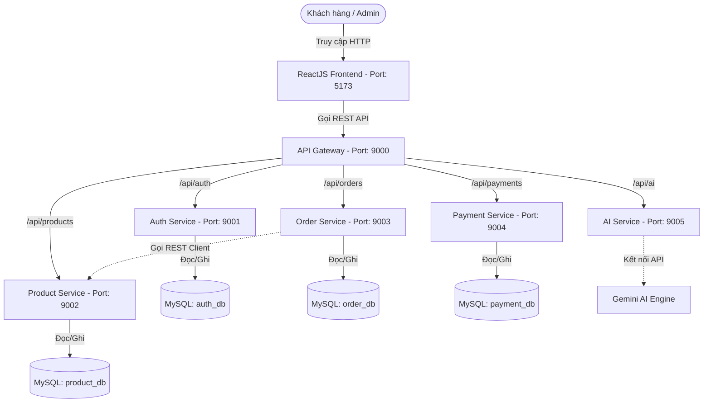

# 🛍️ Nền tảng E-Commerce Microservices & AI Chatbot Tư vấn mua sắm

[](https://quarkus.io/)
[](https://react.dev/)
[](https://www.mysql.com/)
[](https://deepmind.google/technologies/gemini/)
[]()

Nền tảng thương mại điện tử phân tán (**Microservices Architecture**) được thiết kế và phát triển với **Java Quarkus** cho Backend và **ReactJS (Vite)** cho Frontend, tích hợp **AI Chatbot tư vấn bán hàng thông minh (Google Gemini)**. Hệ thống giải quyết trọn vẹn các bài toán nghiệp vụ từ quản lý sản phẩm, quản lý kho hàng biến thể, giỏ hàng, đặt hàng, xử lý thanh toán tự động đến quản trị nội bộ.

---

## 📐 Kiến trúc & Nguyên lý hoạt động (Architecture & Principles)

Hệ thống được thiết kế theo mô hình **Database-per-Service** (Mỗi dịch vụ sở hữu cơ sở dữ liệu riêng độc lập) để đảm bảo tính đóng gói dữ liệu và khả năng mở rộng độc lập.



### 1. Nguyên lý hoạt động cốt lõi:
* **API Gateway (Cổng API - Port 9000):** Là điểm đầu mối duy nhất tiếp nhận tất cả các yêu cầu từ phía Client. Gateway thực hiện cơ chế điều hướng (Routing) thông minh đến các vi dịch vụ tương ứng dựa trên tiền tố đường dẫn (ví dụ: `/api/auth/*` điều hướng về `auth-service`, `/api/products/*` về `product-service`).
* **Giao tiếp liên dịch vụ (Inter-service Communication):** Các vi dịch vụ giao tiếp đồng bộ với nhau thông qua **MicroProfile REST Client** của Quarkus. Điển hình, khi khách hàng tạo đơn hàng, `order-service` sẽ gửi yêu cầu trực tiếp sang `product-service` để kiểm tra và xác thực số lượng tồn kho của từng biến thể sản phẩm.
* **Bảo mật phân tán với JWT (Stateless JWT Security):** 
  - Khi người dùng đăng nhập thành công tại `auth-service`, dịch vụ này sẽ cấp một **JWT Token** được ký số bằng thuật toán mã hóa (chứa định danh và quyền hạn của người dùng).
  - Khi gửi request qua API Gateway đến các service khác, token này được đính kèm vào Header.
  - Các service độc lập tự giải mã và kiểm tra quyền hạn nội bộ thông qua thư viện **SmallRye JWT** tích hợp sẵn mà không cần phải truy vấn lại dịch vụ Auth, giúp giảm thiểu tối đa độ trễ hệ thống.

---

## 🌟 Chức năng nổi bật hệ thống (Key Features)

### 👤 1. Phân hệ khách hàng (User Storefront)
* **Trang chủ & Tìm kiếm thông minh:**
  * Bộ lọc sản phẩm trực quan theo danh mục và thương hiệu.
  * Ô tìm kiếm tích hợp tính năng **Gợi ý tự động (Autocomplete Search Suggestions)** ngay khi gõ phím.
* **Chi tiết sản phẩm & Biến thể phong phú:**
  * Chọn lựa cấu hình biến thể linh hoạt (ví dụ: RAM, SSD, Màu sắc...).
  * Tự động kiểm tra số lượng tồn kho tương ứng với cấu hình biến thể đã chọn.
  * Tính năng **Đặt hàng trước (Pre-order)** được kích hoạt tự động nếu biến thể đã hết hàng trong kho.
* **Giỏ hàng & Thanh toán:**
  * Cập nhật số lượng, áp dụng mã giảm giá (Coupon).
  * Quy trình thanh toán (Checkout) tích hợp **Mã QR chuyển khoản tự động** hoặc thanh toán COD tiện lợi.
* **Lịch sử mua hàng (Order History):**
  * Theo dõi chi tiết đơn hàng qua máy trạng thái: `PENDING` $\rightarrow$ `PROCESSING` $\rightarrow$ `SHIPPED` $\rightarrow$ `DELIVERED` $\rightarrow$ `COMPLETED`.
* **AI Chatbot tư vấn mua sắm 🤖:**
  * Cửa sổ Chatbot tích hợp trực tiếp ở góc màn hình.
  * Phân tích nhu cầu tự nhiên của khách hàng (ví dụ: *"Tư vấn cho tôi laptop khoảng 20-25 triệu để lập trình"*), tự động đối chiếu danh mục sản phẩm đang bán để đưa ra khuyến nghị mua sắm chính xác nhất.

### 🔑 2. Phân hệ quản trị (Admin Portal)
* **Bảng điều khiển (Dashboard):** Thống kê tổng doanh thu, số lượng đơn hàng, khách hàng mới và danh sách đơn hàng mới cần phê duyệt.
* **Quản lý Danh mục & Sản phẩm (CRUD):**
  * Tạo mới danh mục, tự động sinh slug phục vụ SEO.
  * Thêm mới sản phẩm nhanh chóng. Hệ thống hỗ trợ **Thiết lập mặc định tồn kho (Auto-stock)**, tự động khởi tạo cấu hình biến thể cơ bản với số lượng mặc định là `100` sản phẩm giúp tối ưu hóa thời gian đăng tải sản phẩm.
* **Quản lý chi tiết Biến thể (Variants):** Thiết lập giá bán lẻ, mã SKU và quản lý số lượng tồn kho riêng cho từng biến thể (RAM, SSD, màu sắc...).
* **Quản lý người dùng:** Xem danh sách thành viên và phân quyền vai trò (`USER`, `ADMIN`).

### ⚙️ 3. Luồng Nghiệp vụ Kho hàng Nâng cao (Stock Business Logic)
* **Kiểm tra kho thời gian thực:** Khi tiến hành Checkout, hệ thống kiểm tra tồn kho chéo qua REST Client. Nếu thiếu hàng, giao dịch bị chặn ngay lập tức kèm thông báo cụ thể mặt hàng bị thiếu.
* **Thời điểm trừ tồn kho:** Tồn kho **chỉ thực sự bị trừ** khi trạng thái đơn hàng được chuyển sang **`DELIVERED`** (Đang giao hàng) hoặc **`COMPLETED`** (Đã giao hàng thành công).
* **Hoàn trả kho tự động:** Khi đơn hàng bị hoàn/hủy hoặc khách trả hàng (trạng thái chuyển sang **`RETURNED`**), hệ thống tự động sinh phiếu điều chuyển kho dạng `RETURN` để cộng trả lại số lượng sản phẩm vào kho hàng tương ứng.

---

## 💻 Công nghệ cốt lõi (Tech Stack)

### Backend (Microservices)
* **Java 21** - Ngôn ngữ lập trình mạnh mẽ, tối ưu hiệu năng.
* **Quarkus Framework** - Supersonic Subatomic Java, tối ưu hóa bộ nhớ RAM cực kỳ hiệu quả (chỉ sử dụng từ 32MB - 192MB mỗi service khi khởi động).
* **Hibernate ORM với Panache** - Giúp tương tác với DB nhanh chóng theo Pattern Active Record hoặc Repository.
* **SmallRye JWT** - Xử lý xác thực Token JWT phân tán.
* **Quarkus Rest Client** - Giao tiếp đồng bộ liên dịch vụ hiệu năng cao.

### Frontend
* **React 19 & Vite 8** - Cho tốc độ build và khởi động ứng dụng cực kỳ nhanh chóng.
* **React Router DOM v7** - Quản lý định tuyến trang đơn ứng dụng (SPA).
* **Axios** - Thư viện giao tiếp API không đồng bộ.
* **React Icons & Vanilla CSS** - Giao diện tự thiết kế tùy biến, nhẹ nhàng và mượt mà.

### AI Engine & Fallback Mechanism
* Tích hợp **Google Gemini 1.5 Flash API** để xử lý ngôn ngữ tự nhiên và tư vấn sản phẩm.
* **Cơ chế dự phòng (Fallback):** Nếu người dùng không cấu hình API Key hoặc kết nối tới Google Gemini gặp sự cố, hệ thống sẽ tự động chuyển sang **Thuật toán Khuyến nghị Nội bộ bằng Java** (quét tìm từ khóa trong cơ sở dữ liệu sản phẩm để gợi ý tương ứng), đảm bảo dịch vụ chatbot luôn hoạt động liên tục không gián đoạn.

---

## 📂 Kiến trúc thư mục dự án

```text
CNPTPM/
├── backend/                  # Mã nguồn toàn bộ dịch vụ Backend (Quarkus Maven Project)
│   ├── pom.xml               # File cấu hình Maven cha quản lý các module con
│   ├── common-module/        # Chứa DTO, Entity, Exception và ExceptionMapper dùng chung
│   ├── api-gateway/          # Cổng API duy nhất điều phối request (Port: 9000)
│   ├── auth-service/         # Quản lý người dùng, tài khoản và cấp phát JWT (Port: 9001)
│   ├── product-service/      # Quản lý sản phẩm, danh mục, biến thể và kho hàng (Port: 9002)
│   ├── order-service/        # Xử lý giỏ hàng, đặt hàng và máy trạng thái đơn hàng (Port: 9003)
│   ├── payment-service/      # Quản lý thanh toán COD, tạo QR Chuyển khoản (Port: 9004)
│   └── ai-service/           # Tích hợp Gemini AI và thuật toán gợi ý dự phòng (Port: 9005)
├── frontend/                 # Mã nguồn giao diện người dùng ReactJS (Vite - Port: 5173)
├── start-all.ps1             # PowerShell script khởi động toàn bộ dự án nhanh trên Windows
├── start.bat                 # Tệp batch click chạy nhanh toàn bộ dự án
└── README.md                 # Tài liệu hướng dẫn dự án
```

---

## 🛠️ Hướng dẫn Thiết lập & Khởi chạy dự án

### 1. Yêu cầu hệ thống (Prerequisites)
Hãy chắc chắn máy tính của bạn đã được cài đặt:
* **Java Development Kit (JDK) 21** trở lên.
* **Node.js 18** trở lên (bao gồm trình quản lý gói `npm`).
* **MySQL Server 8.0+** đang chạy trên cổng mặc định `3306`.

### 2. Thiết lập Cơ sở dữ liệu (Database Setup)
Khởi chạy MySQL client (MySQL Workbench, DBeaver, phpMyAdmin,...) và chạy câu lệnh SQL sau để tạo 4 cơ sở dữ liệu trống:
```sql
CREATE DATABASE auth_db;
CREATE DATABASE product_db;
CREATE DATABASE order_db;
CREATE DATABASE payment_db;
```
> [!TIP]
> Bạn không cần tạo bảng hay chèn dữ liệu thủ công. Ở lần chạy đầu tiên, Quarkus Hibernate ORM sẽ tự động đọc cấu trúc class Java để tự động tạo bảng (DDL) và tự động nạp dữ liệu mẫu (sản phẩm, tài khoản mẫu) từ các tệp tin `import.sql` nằm trong các thư mục tài nguyên của dịch vụ.

### 3. Cấu hình Gemini AI API Key (Tùy chọn)
Để tính năng Chatbot AI tư vấn thông minh hoạt động tốt nhất, bạn cần chuẩn bị Google Gemini API Key. Bạn có hai cách cấu hình:
* **Cách 1 (Khuyên dùng cho Backend):** Thiết lập biến môi trường trên máy tính hoặc IDE với tên là `GEMINI_API_KEY`.
* **Cách 2 (Trực tiếp tại Frontend):** Trên giao diện Web khi khởi chạy, click vào biểu tượng **Cài đặt** (Bánh răng) trong khung cửa sổ Chatbot ở góc phải màn hình và dán mã API Key của bạn vào đó. Hệ thống sẽ lưu trữ khóa bảo mật trong `LocalStorage` trình duyệt của bạn.

---

### 4. Biên dịch và Đóng gói Backend (Mandatory Build Step)
Trước khi khởi chạy hệ thống bằng các script chạy nhanh, bạn cần tiến hành biên dịch các microservice backend thành các tệp tin JAR thực thi.

Mở terminal tại thư mục `backend/` và chạy lệnh sau:
```bash
mvn clean package -DskipTests
```
*(Hoặc dùng Maven Wrapper đi kèm dự án nếu máy tính của bạn chưa cấu hình Maven toàn cục: `.\mvnw clean package -DskipTests`)*

Lệnh này sẽ quét toàn bộ dự án cha, đóng gói các module con và tạo ra các thư mục `target/quarkus-app/` chứa file `quarkus-run.jar` chạy trực tiếp.

---

### 5. Khởi chạy toàn bộ hệ thống (Execution)

#### Cách 1: Sử dụng Batch script (Tiện lợi nhất trên Windows)
1. Di chuyển về thư mục gốc của dự án (`CNPTPM/`).
2. Double-click vào tệp tin **`start.bat`**. 
3. Script sẽ tự động gọi PowerShell, nạp thiết lập mã hóa UTF-8 tiếng Việt, mở các tab terminal riêng biệt và chạy đồng loạt 6 dịch vụ Backend Quarkus cùng Frontend ReactJS.

#### Cách 2: Khởi chạy thủ công chế độ lập trình (Development Mode)
Nếu bạn muốn sửa đổi mã nguồn (Hot Reload) và theo dõi log chi tiết trong quá trình phát triển dự án, hãy chạy thủ công bằng các bước sau:

* **Khởi chạy các Backend Microservices (Mở các terminal riêng lẻ trong thư mục `backend/`):**
  ```bash
  mvn -pl api-gateway quarkus:dev
  mvn -pl auth-service quarkus:dev
  mvn -pl product-service quarkus:dev
  mvn -pl order-service quarkus:dev
  mvn -pl payment-service quarkus:dev
  mvn -pl ai-service quarkus:dev
  ```
* **Khởi chạy Frontend ReactJS:**
  Mở terminal tại thư mục `frontend/` và chạy lệnh:
  ```bash
  npm install
  npm run dev
  ```

---

## 📍 Bản đồ Cổng Dịch vụ & Tài khoản Thử nghiệm

### Bản đồ Cổng Dịch vụ (Ports Map)

| Tên Dịch vụ | Cổng (Port) | Địa chỉ URL chạy mặc định | Mô tả |
| :--- | :--- | :--- | :--- |
| **API Gateway** | `9000` | `http://localhost:9000` | Cổng tiếp nhận REST API tập trung |
| **Auth Service** | `9001` | `http://localhost:9001` | Xác thực, phân quyền và tài khoản |
| **Product Service**| `9002` | `http://localhost:9002` | Quản lý sản phẩm, biến thể, kho hàng |
| **Order Service** | `9003` | `http://localhost:9003` | Quản lý giỏ hàng, đơn hàng |
| **Payment Service**| `9004` | `http://localhost:9004` | Cổng sinh QR chuyển khoản & COD |
| **AI Service** | `9005` | `http://localhost:9005` | Gemini AI & Thuật toán khuyến nghị |
| **Frontend Web** | `5173` | `http://localhost:5173` | Giao diện ReactJS (Vite) |
| **MySQL Server** | `3306` | `localhost:3306` | Hệ quản trị cơ sở dữ liệu |

### Tài khoản Đăng nhập Thử nghiệm

Hệ thống đã nạp sẵn các tài khoản thử nghiệm sau đây để bạn dễ dàng chạy kiểm thử (Demo):

| Quyền hạn | Tên đăng nhập / Email | Mật khẩu | Phạm vi sử dụng |
| :--- | :--- | :--- | :--- |
| **Quản trị viên (Admin)** | `admin` hoặc `admin@gmail.com` | `123456` | Đăng nhập trang Admin quản lý kho, sản phẩm, doanh thu |
| **Khách hàng (User)** | `nguyenvana` | `123456` | Mua sắm, thanh toán đơn hàng, chat tư vấn AI |

---
Chúc bạn báo cáo dự án thành công rực rỡ và phát triển dự án thêm nhiều tính năng đột phá! 🎉
